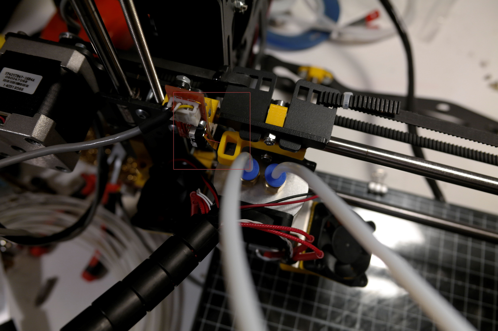

# Problems
The X-axis doesn't reach to the break of the end stop, causing some skipping noise of the GT2 Belt. For these the break as to be a little wider like 3 mm bigger.
**Images***

## Changes:
Edit the original X brake to bee 4mm wider!

# V1

Works OK! 

I have to tighten the clearances for a better fit! I will be making on version 2 with less 0.5mm 